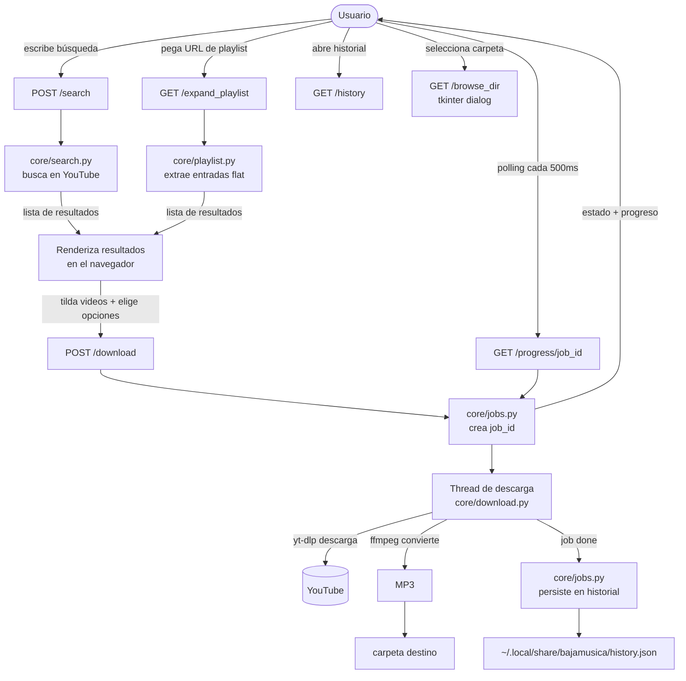

# Sonido — YouTube Downloader

Interfaz web local para buscar videos en YouTube, cargar playlists completas,
elegir cuáles bajar, y guardarlos como MP3 o MP4 en tu carpeta de música.
Pensado para correr en Linux (y Windows), en `localhost`, sin que salga
nada a internet salvo las requests a YouTube.

---

## Requisitos

- **Python 3.10+**
- **ffmpeg** — para la conversión de audio:
  ```bash
  sudo apt install ffmpeg
  ```
- **tkinter** — para el selector nativo de carpeta (ya incluido en Python de Windows; en Linux):
  ```bash
  sudo apt install python3-tk
  ```

## Uso

Desde la carpeta del proyecto:

```bash
chmod +x run.sh      # solo la primera vez
./run.sh
```

El script crea un entorno virtual, instala las dependencias, y arranca el
servidor. El navegador se abre solo en `http://127.0.0.1:5000`.

### Búsqueda normal

1. Escribí una búsqueda (ej: *canciones de Pescetti*) y presioná **Buscar**.
2. Tildá los videos que querés.
3. Elegí calidad, esquema de nombre y carpeta destino.
4. Click en **Descargar** — vas a ver el progreso de cada archivo.

### Bajar una playlist completa

1. Pegá la URL de la playlist de YouTube directamente en el buscador
   (ej: `https://www.youtube.com/playlist?list=PLxxxxxx`).
2. La app la expande automáticamente y selecciona todos los tracks.
3. Revisá la selección si querés, luego **Descargar**.

---

## Estructura

```
bajamusica/
├── app.py                 # servidor Flask + rutas (capa fina)
├── config.py              # toda la config ajustable
├── core/                  # lógica de negocio, independiente de Flask
│   ├── search.py          #   búsqueda en YouTube
│   ├── download.py        #   descarga + conversión
│   ├── playlist.py        #   expansión de playlists completas
│   ├── jobs.py            #   estado de tareas + historial en disco
│   ├── metadata.py        #   lookup y escritura de etiquetas vía MusicBrainz
│   └── util.py            #   helpers
├── templates/
│   └── index.html         # la UI
├── static/
│   ├── css/style.css
│   └── js/app.js
├── requirements.txt
└── run.sh                 # lanzador
```

---

## Flujo de uso



---

## Decisiones de diseño

- **Backend desacoplado del frontend.** El paquete `core` no sabe nada de
  Flask. Podés reusarlo desde una CLI, una API distinta, o tests, sin tocar
  el servidor. Las rutas en `app.py` son finas: solo reciben, validan y
  delegan.

- **Config centralizada.** Todo lo ajustable (carpeta destino, puerto,
  calidades, límites de búsqueda, ruta del historial) vive en `config.py`.
  No hay valores mágicos desperdigados.

- **Historial en disco.** `core/jobs.py` persiste cada descarga completada en
  `~/.local/share/bajamusica/history.json` (máx. 500 entradas). La UI lo
  muestra en un modal accesible con el botón **Historial** en la barra superior.

- **Selector nativo de carpeta.** El botón junto al campo "Carpeta" abre el
  diálogo nativo del OS vía `tkinter.filedialog`. El mismo código funciona en
  Linux y Windows sin cambios.

- **Playlists vía flat-extract.** `core/playlist.py` usa yt-dlp en modo
  `extract_flat` para obtener metadatos de toda la lista sin descargar nada.
  El frontend detecta automáticamente si la query es una URL con `list=` y
  desvía la request al endpoint correcto.

- **Progreso por polling.** El frontend consulta `/progress/<job_id>` cada
  500ms. Es más robusto y simple que WebSockets/SSE para un caso local. El
  progreso se muestra en un panel inline (no tapa los resultados), con una barra
  global y, por archivo, barra sólida + velocidad/ETA/tamaño. El polling es
  independiente del panel: ocultarlo no detiene el seguimiento, y el botón
  **Descargas** lo vuelve a mostrar.

- **Descargas en thread aparte.** El servidor corre con `threaded=True`, así
  el polling responde mientras la descarga avanza. Los items de una tarea se
  procesan secuencialmente; paralelizarlos es un cambio acotado en
  `core/download.py`.

- **Frontend sin frameworks.** HTML + CSS + JS vanilla, una sola página. Cero
  build, cero dependencias de node. Fácil de entender y de extender.

---

## Ideas para extender

- Descargas en paralelo (cambio acotado en `core/download.py`).
- Más formatos (FLAC, WAV, etc.) — se agregan en `config.SUPPORTED_FORMATS`
  y `core/download.py`.
- Re-descargar desde el historial con un click.

---

> **Nota legal:** descargá solo contenido sobre el que tengas derechos o que
> esté libre de restricciones. Esta herramienta es para uso personal.
