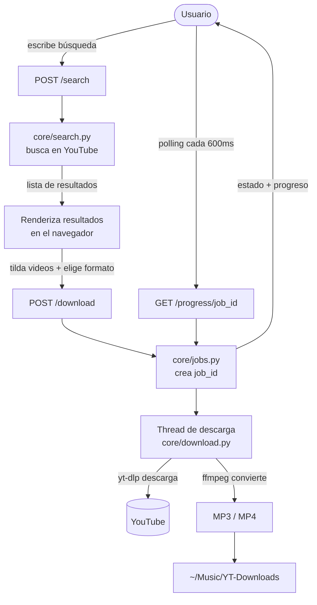

# Sonido — YouTube Downloader

Interfaz web local para buscar videos en YouTube, elegir cuáles bajar, y
guardarlos como MP3 o MP4 en tu carpeta de música. Pensado para correr en
Linux, en `localhost`, sin que salga nada a internet salvo las requests a
YouTube.

---

## Requisitos

- **Python 3.10+**
- **ffmpeg** — para la conversión de audio/video:
  ```bash
  sudo apt install ffmpeg
  ```

## Uso

Desde la carpeta del proyecto:

```bash
chmod +x run.sh      # solo la primera vez
./run.sh
```

El script crea un entorno virtual, instala las dependencias, y arranca el
servidor. El navegador se abre solo en `http://127.0.0.1:5000`.

1. Escribí una búsqueda (ej: *canciones de Pescetti*).
2. Tildá los videos que querés.
3. Elegí formato (MP3 / MP4) y calidad.
4. Click en **Descargar** — vas a ver el progreso de cada archivo.

Los archivos quedan en `~/Music/YT-Downloads`.

---

## Estructura

```
yt-downloader/
├── app.py                 # servidor Flask + rutas (capa fina)
├── config.py              # toda la config ajustable
├── core/                  # lógica de negocio, independiente de Flask
│   ├── search.py          #   búsqueda en YouTube
│   ├── download.py        #   descarga + conversión
│   ├── jobs.py            #   registro de estado de tareas
│   └── util.py            #   helpers
├── templates/
│   └── index.html         # la UI
├── static/
│   ├── css/style.css
│   └── js/app.js
├── requirements.txt
└── run.sh                 # lanzador
```

---

## Flujo de uso



---

## Decisiones de diseño (para que escale)

- **Backend desacoplado del frontend.** El paquete `core` no sabe nada de
  Flask. Podés reusarlo desde una CLI, una API distinta, o tests, sin tocar
  el servidor. Las rutas en `app.py` son finas: solo reciben, validan y
  delegan.

- **Config centralizada.** Todo lo ajustable (carpeta destino, puerto,
  calidades, límites de búsqueda) vive en `config.py`. No hay valores mágicos
  desperdigados.

- **Estado de tareas aislado en `jobs.py`.** Hoy es un dict en memoria. El día
  que quieras persistir el historial a disco o a una base de datos, ese es el
  único módulo a reemplazar.

- **Progreso por polling.** El frontend consulta `/progress/<job_id>` cada
  600ms. Es más robusto y simple que WebSockets/SSE para un caso local, y deja
  la puerta abierta a migrar a SSE después si hiciera falta.

- **Descargas en thread aparte.** El servidor corre con `threaded=True`, así
  el polling responde mientras la descarga avanza. Por ahora los items de una
  tarea se procesan secuencialmente; paralelizarlos es un cambio acotado en
  `core/download.py`.

- **Frontend sin frameworks.** HTML + CSS + JS vanilla, una sola página. Cero
  build, cero dependencias de node. Fácil de entender y de extender.

---

## Ideas para extender

- Selector de carpeta destino desde la UI.
- Historial persistente de descargas.
- Soporte de playlists completas.
- Descargas en paralelo.
- Más formatos (FLAC, WAV, etc.) — se agregan en `config.SUPPORTED_FORMATS`
  y `core/download.py`.

---

> **Nota legal:** descargá solo contenido sobre el que tengas derechos o que
> esté libre de restricciones. Esta herramienta es para uso personal.
